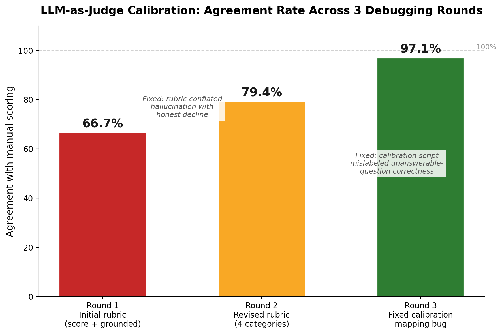

# Building and Calibrating an Automated LLM-as-a-Judge Evaluator

### An Engineering Report - AskMyDocs Project (Evaluation Methodology)

---

## 1. Objective

The original AskMyDocs benchmark (see `EXPERIMENT_REPORT.md`) scored every model's answer by hand against a verified expected answer, a legitimate first-pass method, but not one that scales or reproduces automatically. But, the question arises: *"how would you do this at scale?"*

This report documents the response to that question: building an automated **LLM-as-a-judge** evaluator, and critically proving it can be trusted before relying on it, by calibrating it against the same 36 answers that had already been scored manually.

> **Goal:** replace manual answer scoring with an automated judge, without silently trading away accuracy for scale.

---

## 2. Why This Matters

"LLM-as-a-judge" is now standard practice in applied AI engineering for evaluating generation quality at a scale human review can't match. But an automated judge is only useful if it agrees with a trustworthy human baseline. An uncalibrated judge can silently produce plausible-looking but wrong evaluation numbers, which is arguably worse than no automated evaluation at all, since it looks rigorous while not being reliable.

This project treats the judge itself as something to be tested, not trusted by default. The same experimental discipline already applied to the LLMs being benchmarked.

---

## 3. Methodology

### 3.1 Judge Selection

The judge model was deliberately chosen to be **`gemma3:4b`** ; a model *not* among the three being evaluated (`phi3`, `llama3.2:3b`, `qwen2.5:3b`). Using one of the evaluated models to judge itself or its peers risks **self-preference bias**, a documented failure mode in LLM-evaluation research where a model rates outputs resembling its own more favorably.

### 3.2 Context Reconstruction

The original benchmark's result log did not store the retrieved context per answer, only the question and final answer. Because retrieval is deterministic given a fixed document, embedding model, and `k`, the exact context each model originally saw was reconstructed by re-running the retrieval step alone, without re-running any of the LLMs.

### 3.3 Calibration-First Approach

Before trusting the judge on any new data, it was run against the **same 36 answers** that had already been scored manually in the original benchmark (12 questions × 3 models), and the judge's output was compared directly against that human-labeled ground truth. Agreement rate was not the judge's raw output, it was the metric that determined whether the judge was fit for use.

---

## 4. Results

### 4.1 Calibration required three iterative rounds, each fixing a distinct root cause

**Round 1: Initial rubric (0–2 score + a grounded true/false flag): 66.7% agreement.**
Investigating the disagreements showed they were not independent errors. Nine of twelve shared one root cause: the rubric had no category for "correctly declined to answer." Both a genuine hallucination and an honest "I couldn't find that" were scored identically (`0, grounded=False`), so every correct decline registered as a false disagreement with the manual `safe_miss` label. This was a rubric design flaw, not judge unreliability.

**Round 2: Revised rubric (four explicit categories: correct / correct_decline / incomplete_decline / hallucinated), with an added instruction to verify factual claims character-by-character against the retrieved context: 79.4% agreement** (calculated over the subset of labels with a direct category equivalent).
The original conflation was fully resolved, every correctly-declined answer now matched. A new cluster of six disagreements appeared instead, all on the two "unanswerable" test questions across all three models.

Diagnosing this revealed the second root cause was **in the calibration script, not the judge.** Those two questions were specifically designed so that "not mentioned in the document" *is* the correct answer. Meaning the judge's `correct_decline` category and the human label of `correct` described the exact same outcome, just from different angles. The comparison logic had not been written to recognize that equivalence.

**Round 3: Fixed the comparison logic to treat `correct` and `correct_decline` as equivalent specifically for unanswerable-category questions: 97.1% agreement (33 of 34 comparable cases).**

### 4.2 The one remaining disagreement is itself a meaningful, well-understood finding

The single case the judge scored incorrectly was a question where one model had fabricated financial figures partway through a multi-step calculation, then reached a coincidentally correct final conclusion. The judge's own reasoning showed exactly how it was fooled: it verified that the model's *arithmetic was internally consistent* - the percentages were correctly computed *from* the numbers the model stated but never cross-checked whether those starting numbers actually existed anywhere in the source text. They did not; they were invented.

This is a specific, mechanistic limitation of using a compact local model as a judge: catching a fabrication requires actively cross-referencing each individual figure against a long context, rather than checking whether a chain of reasoning is self-consistent. A fluent, well-structured calculation built on fabricated inputs can pass a determinism check while still being wrong at its foundation.

Separately, in one of two answers excluded from the strict agreement count (because the manual label didn't map cleanly onto the judge's categories), the judge flagged a different model's answer as a hallucination by naming the exact fabricated figure and confirming it was absent from the retrieved context independently arriving at the same root cause that had previously been identified through manual review, without being told what to look for.

---

## 5. Problems Encountered and How They Were Solved

**Problem: the first rubric conflated two opposite behaviors into one category.**
A model hallucinating and a model honestly admitting it didn't know were both scored as failures, making it impossible to distinguish a dangerous error from correct, cautious behavior. Solved by redesigning the rubric around four explicit, mutually exclusive categories instead of a numeric score.

**Problem: a majority of "judge errors" in Round 2 were actually a bug in the evaluation script, not the judge.** Six disagreements initially looked like the judge failing on a specific question type. Closer inspection showed the judge's reasoning was correct in every one of those cases. The script comparing judge output to the manual label had not accounted for a case where two differently-named outcomes were factually equivalent. This was fixed at the comparison-logic level, not by changing the judge or its prompt again.

---

## 6. Conclusion

A carefully-designed judge, calibrated directly against a human-labeled baseline, reached 97% agreement with manual scoring on this evaluation task, high enough to replace manual review for routine evaluation at scale. The process of getting there surfaced two distinct, fixable design flaws- one in the judge's rubric, one in the calibration script itself. Neither of which would have been caught by simply trusting the judge's first output.

The one genuine remaining disagreement is not a reason to discard the judge; it identifies precisely where automated evaluation still needs human oversight: verifying specific numerical claims in multi-step reasoning against long source documents. In practice, this suggests a hybrid evaluation strategy- automated judging for routine, high-volume scoring, with targeted human spot-checks on any answer involving multi-step numerical reasoning.

---

## 7. Limitations and Future Work

- Calibration was performed against 36 answers from a single benchmark run on a single document; a larger and more varied calibration set would give a more statistically robust agreement estimate.
- A natural next step is extending the judge to score the full, uncalibrated dataset (all repeated runs, all prompt variants) and to flag any answer involving a multi-step numerical calculation for mandatory human review, directly addressing the one confirmed failure mode identified here.
