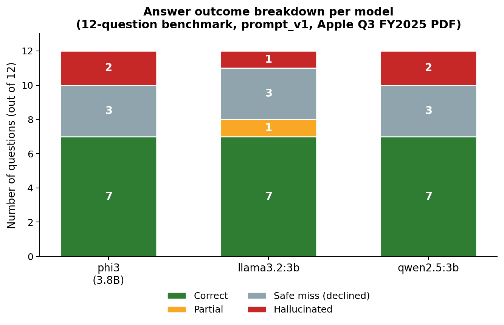
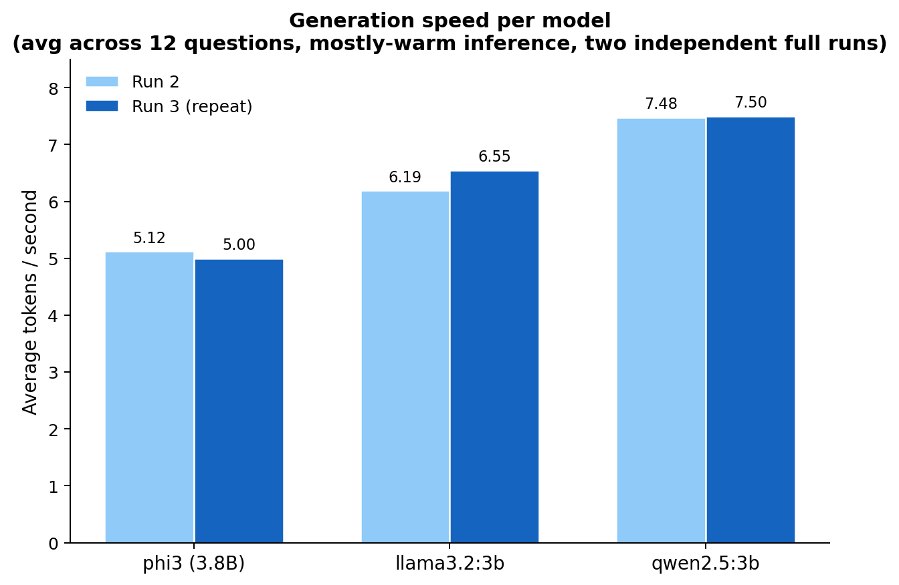
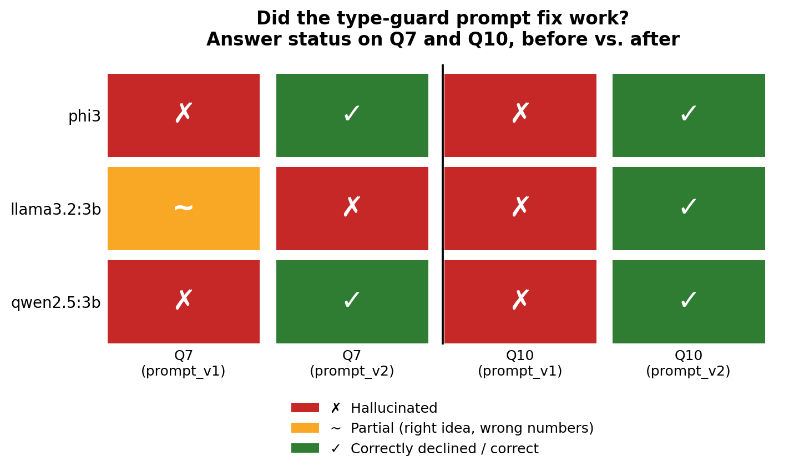
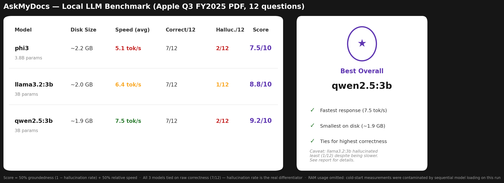

# Benchmarking Local LLMs for RAG on Consumer Hardware

### An Engineering Report: AskMyDocs Project

---

## 1. Objective

The goal of this project was to move beyond building a working Retrieval-Augmented Generation (RAG) application and instead treat it as a controlled engineering experiment. Specifically, I set out to answer:

> **How do different locally-run LLMs compare in accuracy, hallucination behavior, and latency when used for PDF-based question answering - on hardware a typical engineer actually owns, not a cloud GPU?**

I built a PDF question-answering system (FastAPI backend, LangChain for chunking/embedding, Chroma as the vector store, Ollama for local model inference), then used it as a testbed to benchmark three small open-weight models under identical conditions. The purpose was not to declare a "winner," but to produce evidence-backed findings about where each model succeeds, where it fails, and why.

---

## 2. Why This Matters

Most public LLM benchmarks assume unlimited cloud compute. In practice, a large share of real-world AI engineering - internal tools, offline-capable products, cost-sensitive startups, privacy-constrained industries (legal, healthcare, finance) - runs on modest, local, or edge hardware. Two problems dominate that setting, and both are usually invisible in leaderboard-style comparisons:

1. **Hallucination under constrained retrieval.** Small models with limited context are more likely to fill gaps with plausible-sounding fabrication rather than admit uncertainty, a serious risk in any application making claims about real documents (financial reports, contracts, medical records).
2. **The gap between benchmark speed and real device speed.** A model's published throughput rarely reflects performance under actual memory pressure, cold starts, and background system load - the exact conditions a real user's laptop is in.

This project was designed specifically to surface both problems, using a real financial document (Apple's Q3 FY2025 earnings release) rather than synthetic test data.

---

## 3. Methodology

### 3.1 System Architecture

```
PDF Upload → Chunking (500 chars, 50 overlap) → Embedding (nomic-embed-text)
           → Chroma Vector Store (persisted to disk) → Similarity Search (top-k)
           → Prompt Construction → Local LLM (Ollama) → Answer + Metrics
```

Every `/ask` request was instrumented to capture, per call: total duration, model load time, prompt evaluation time, generation time, tokens generated, tokens/second, system RAM before/peak/after, and whether the call was a cold start (model freshly loaded) or warm (model already resident in memory).

### 3.2 Experimental Design

To ensure any difference in output was attributable to the *model* and not the pipeline, the following were held constant across all three models: embedding model, chunk size, chunk overlap, retrieved context (`k`), temperature (`0`), and the prompt template. Only the generation model varied. This follows standard controlled-experiment practice - change one variable at a time.

### 3.3 Test Data

- **Document:** Apple Inc. Q3 FY2025 earnings press release (8 pages, real SEC filing).
- **Question set:** 12 hand-written questions, each independently verified against the source text, spanning six categories: factual lookup, comparison, summarization, multi-hop reasoning, and critically - questions with **no answer present in the document**, used specifically to test hallucination.
- **Models:** `phi3` (3.8B, Microsoft), `llama3.2:3b` (Meta), `qwen2.5:3b` (Alibaba) - the largest models realistically operable on 8GB of RAM.
- **Hardware:** Intel i5-10210U laptop, 8GB DDR4 RAM, 2GB dedicated GPU - deliberately modest, representative hardware rather than a workstation.

---

## 4. Results

### 4.1 Accuracy alone did not differentiate the models

All three models answered 7 of 12 questions correctly. Had the experiment stopped there, the conclusion would have been "the models are interchangeable" which turned out to be false. Breaking down the remaining five questions by *how* each model failed revealed the real differences:



A model that safely declines to answer ("I couldn't find that in the document") is behaving correctly, even though it didn't answer. A model that hallucinates is not. `llama3.2:3b` hallucinated least (1 of 12) despite tying on raw accuracy with the other two, which hallucinated twice as often. This is the more decision-relevant metric for any real deployment.

### 4.2 Speed differences were consistent, not incidental

The full 12-question benchmark was run twice, independently, on different days with different background system load, specifically to check whether any speed ranking was a stable property of the model or an artifact of one noisy session.



The ranking held across both runs: `qwen2.5:3b` was fastest (≈7.5 tokens/sec), `phi3` slowest (≈5.1 tokens/sec). Notably, cold-start load time was found to dominate response time by as much as **12x** compared to warm inference on identical requests, a factor a naive single-run benchmark would completely miss, and one that materially changes what "fast" means in a real, session-based application.

### 4.3 A reproducible hallucination pattern, and a partial fix

The most significant finding came from one deliberately unanswerable question: *"How many iPhones did Apple sell in Q3 fiscal 2025?"* The document reports iPhone **revenue**, never unit counts.

**All three models hallucinated on this question, independently**, each reusing the revenue figure ($44,582 million) as though it were a unit count. Because this failure was consistent across three separately-trained model families, it pointed to a **prompt design flaw**, not a model weakness: the prompt guarded against *missing* information, but not against a plausible number of the *wrong type* being substituted in.

I added one targeted instruction - requiring the model to check whether a retrieved figure matches the *type* of information the question asks for and re-tested.



The fix eliminated the hallucination for `phi3` and `qwen2.5:3b`, and — unexpectedly — also fixed a second, unrelated hallucination on a comparison question I had not specifically targeted. For `llama3.2:3b`, the outcome was mixed: it stopped hallucinating on the original question, but began fabricating a confident, wrong answer on a different multi-hop question it had previously declined safely. Investigating its retrieved context showed the actual cause: the figure it needed was never retrieved in the first place. **The prompt fix could correct a reasoning error, but it could not fix missing data** and for this model, being instructed to reason more carefully appears to have made it more willing to guess rather than more cautious.

I additionally tested whether retrieving more context (`k=5` instead of `k=3`) would close this gap. It did not change the outcome for either model whose behavior could be trusted run-to-run; a useful negative result indicating the bottleneck is more likely in how tabular financial data is chunked from the PDF, not in retrieval breadth.

### 4.4 Summary Comparison



No single model is objectively "best", the ranking depends on what is weighted more heavily. Under a 50/50 speed-versus-groundedness weighting, `qwen2.5:3b` scores highest; weighting groundedness more heavily would rank `llama3.2:3b` first instead, since it hallucinated least. Both are defensible choices depending on the deployment context. A customer-facing financial assistant should likely weight groundedness far more heavily than raw speed.

---

## 5. Engineering Problems Encountered and How They Were Solved

An engineering report is incomplete without the failures. This project involved several, each of which changed the methodology.

**Problem: the application crashed when indexing a large, table-heavy PDF.**
An initial 35-page financial document caused a full system crash on the 8GB laptop during chunking/embedding. Rather than pushing forward on faulty infrastructure, I retired that document and switched to a shorter, structurally similar 8-page filing a deliberate scope reduction to keep the experiment stable, documented as a limitation rather than hidden.

**Problem: the vector database silently reset on every server restart.**
The Chroma index was held in memory only. Every backend reload (including automatic ones during development) wiped it, causing multiple failed benchmark runs that silently returned "please upload a PDF first" instead of real answers. This was fixed by persisting the index to disk and loading it automatically on startup, then validated with an explicit restart-and-query test with no re-upload.

**Problem: cold-start latency was initially conflated with genuine model speed.**
Early single-shot tests made `phi3` appear to be a slow model. Running the identical request twice in a row revealed a **12x** latency drop on the second call, the first call included model *loading* time, not just inference. This led to explicitly instrumenting and labeling every call as cold or warm, and reporting the two separately throughout the rest of the study.

**Problem: ambient system memory pressure skewed absolute timing numbers between sessions.**
The same model, same question, and same code produced roughly 2x different speeds across two different testing sessions, driven entirely by how much RAM other running applications were consuming. This was addressed by logging system RAM state alongside every result and prioritizing *relative* comparisons between models measured in the same session over absolute numbers compared across sessions.

**Problem: one model's outputs were not reproducible, undermining confidence in single-run results.**
While re-testing after the prompt fix, `llama3.2:3b` produced two different answers to an identical input (same model, same question, same retrieved context, temperature 0) across two separate runs - while the other two models were perfectly reproducible on every repeated test. Rather than discard this as noise, I treated it as a finding: single-run results for that model are now explicitly flagged as provisional, while the other two are treated as reliable without repetition. This is a direct example of revising an earlier conclusion (an initial claim of "full determinism") once new evidence contradicted it.

---

## 6. Conclusion

Locally-run 3-4B parameter models are viable for constrained-domain RAG question answering on ordinary consumer hardware, achieving correct, grounded answers on the majority of realistic questions. However, all three models tested shared a specific, previously undocumented failure mode: substituting a retrieved number of the wrong type when a question could not actually be answered from the source document. This was fixed for two of three models with a small, targeted prompt change - and that same fix exposed a second issue (retrieval coverage) that prompt engineering alone cannot solve, along with a genuine model-level reproducibility limitation that would have gone unnoticed without deliberate repeated testing.

The core engineering takeaway is that **model selection is not the hardest part of building a reliable local RAG system**, controlling for cold starts, system load, retrieval coverage, and prompt-level reasoning gaps is. A benchmark that only measures accuracy on a single run would have missed every one of these findings.

---

## 7. Limitations and Future Work

- Testing was limited to a single document type (financial press release); results may not generalize to other domains such as legal or technical text.
- The RAM-per-model comparison was intentionally omitted from this report: cold-start memory measurements were contaminated by sequential model loading within the same session, and reporting them would have implied a precision the data does not support.
- Each experimental condition was run once or twice; broader statistical confidence would require a larger number of repetitions, particularly for the model shown to be non-deterministic.
- Planned next steps include testing chunking strategy directly (since increasing `k` alone did not resolve the retrieval gap identified in Section 4.3), and extending the question set across additional document types.
